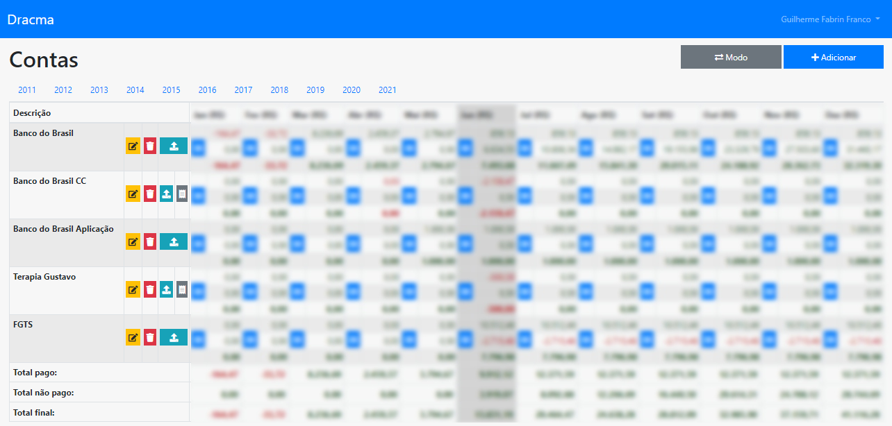

# Dracma Finance System Laravel

## What's this?

This is a simple and old project developed in Laravel 5.5 and Bootstrap 4 to manage some accounts and credit cards.

## Installation

- Install php > 7.0.0 to run this project.
- Install composer
- Run: php composer install
- Install nodejs
- Run: npm run dev or npm run watch
- Create and configure the .env file with .env.example file
- Run: php artisan key:generate
- Run: php artisan migrate
- Run: php artisan db:seed
- Run: php artisan serve and go to http://127.0.0.1:8000

## Practical use

## Demo Video
